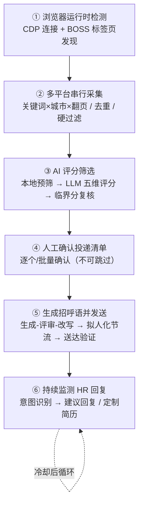
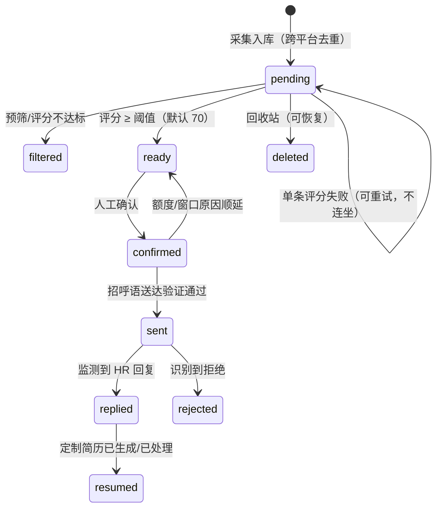
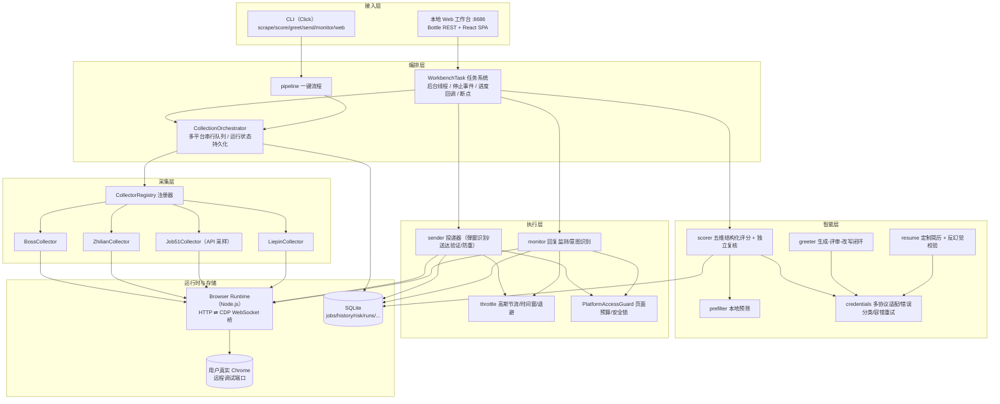

# BossHunter（JD 猎手）项目深度分析报告

> 本报告基于 BossHunter v2.3.2 源码逐模块阅读后整理，所有结论均可在对应源码文件中找到依据。报告内容包括：产品定位、系统架构、关键实现剖析、创新点提炼，以及从竞赛评审视角分析其国家级一等奖（"国一"）竞争力来源。

---

## 一、项目概览

### 1.1 一句话定位

**BossHunter 是一个本地运行、以"人工最终拍板"为铁律的端到端智能求职 Agent**：在用户自己的 Chrome 中完成多平台岗位采集 → AI 预筛与结构化评分 → 人工确认 → 个性化招呼语生成 → 拟人化低频投递 → HR 回复监测 → 岗位定制简历生成的完整求职闭环。

### 1.2 基本信息

| 项目 | 内容 |
|---|---|
| 形态 | Python CLI + 本地 Web 工作台（Bottle 后端 / React 前端）+ Node.js 浏览器运行时 |
| 技术栈 | Python 3.10+、Click、httpx、patchright（反检测 Playwright）、SQLite、Bottle；Node.js 22+（CDP/WebSocket）；React 18 + TypeScript + Vite + Tailwind + shadcn/ui + Recharts |
| 代码规模 | 89 个源码文件（Python/JS/TS），约 960 KB；44 个测试文件，**608 项测试 + 21 个子测试**（v2.3.2 发布验收数据） |
| 支持平台 | BOSS 直聘（采集+投递+监听）、智联招聘、前程无忧 51job、猎聘（后三者只读采集，人工投递回填） |
| AI 兼容 | Anthropic Claude 原生协议 + OpenAI 兼容协议（DeepSeek、豆包、任意自定义网关） |
| 开源模式 | 源码可见、PolyForm Noncommercial 非商业许可；有完整治理体系（维护者制度、贡献度核算、CI、PR 模板） |

### 1.3 产品原则（贯穿全部代码的三条主线）

1. **人在环上（Human-in-the-loop）**：所有投递必须人工确认，不可被配置或代码绕过；自动回复 HR 默认关闭（[config.example.yaml](file:///d:/code/BossHunter/config.example.yaml#L124) 中 `auto_reply_hr_questions: false`）。
2. **Fail-closed（遇风险即停）**：验证码、登录墙、限流、未知页面结构 → 立即安全停止，不绕过、不换代理、不硬闯。
3. **数据不出本机**：简历、API Key 全部保存在本地；API Key 走独立受限凭据文件，不进 config.yaml、不进日志、不进导出包。

---

## 二、业务流程与状态闭环

系统主流程在 [pipeline.py](file:///d:/code/BossHunter/src/bosshunter/pipeline.py#L10-L109) 中编排，是一条 6 步线性管线：

岗位在 SQLite 中走一条显式状态机（[db.py](file:///d:/code/BossHunter/src/bosshunter/db.py#L53-L75)）：

**设计要点**：评分失败的岗位保留 `pending` 而不是被丢弃；鉴权/额度/限流等服务级故障只暂停整批并记录断点，下次运行从断点续跑（[scorer.py](file:///d:/code/BossHunter/src/bosshunter/ai/scorer.py#L696-L718)）。"部分成功"被当作正常结果而非整体失败。

---

## 三、系统架构

### 3.1 分层架构

### 3.2 模块职责一览

| 模块 | 核心文件 | 职责 |
|---|---|---|
| 入口/编排 | [main.py](file:///d:/code/BossHunter/src/bosshunter/main.py)、[pipeline.py](file:///d:/code/BossHunter/src/bosshunter/pipeline.py) | CLI 命令组、首跑引导、六步流程编排 |
| 采集框架 | [collection/](file:///d:/code/BossHunter/src/bosshunter/collection/orchestrator.py) | Collector 协议、注册器、编排器、共享过滤/持久化、跨平台数据契约 |
| 浏览器层 | [browser/](file:///d:/code/BossHunter/src/bosshunter/browser/client.py)、[cdp-proxy.mjs](file:///d:/code/BossHunter/src/bosshunter/browser/runtime/cdp-proxy.mjs) | 自研 HTTP→CDP 运行时、标签页管理、JS 求值、可信点击/输入 |
| AI 层 | [ai/](file:///d:/code/BossHunter/src/bosshunter/ai/scorer.py) | 预筛、评分、招呼语、定制简历、多服务商凭据与错误归一 |
| 执行层 | [executor/](file:///d:/code/BossHunter/src/bosshunter/executor/sender.py)、[throttle.py](file:///d:/code/BossHunter/src/bosshunter/throttle.py)、[platform_safety.py](file:///d:/code/BossHunter/src/bosshunter/platform_safety.py) | 保守发送、节奏控制、页面预算与风险锁、回复监测 |
| Web 层 | [web/server.py](file:///d:/code/BossHunter/src/bosshunter/web/server.py)、[frontend/](file:///d:/code/BossHunter/src/bosshunter/web/frontend/src/App.tsx) | 本地看板、配置管理、任务控制（起/停/暂停/恢复）、预检 |
| 数据层 | [db.py](file:///d:/code/BossHunter/src/bosshunter/db.py) | SQLite 表结构与多版本迁移、运行断点、回收站 |

### 3.3 技术选型上的两个关键决策

1. **不用 Selenium/纯 Playwright 脚本驱动浏览器，而是自研一层本地 HTTP→CDP 桥**（[cdp-proxy.mjs](file:///d:/code/BossHunter/src/bosshunter/browser/runtime/cdp-proxy.mjs)），Python 侧只发 HTTP 请求（[client.py](file:///d:/code/BossHunter/src/bosshunter/browser/client.py#L13-L107)）。好处：复用用户**已登录的真实 Chrome 配置**、所有操作可在用户浏览器中后台标签页完成、语言无关的简单协议、运行时可独立诊断。
2. **不直接调招聘平台私有接口发消息**（只有只读的 51job 搜索走了页面上下文 fetch），投递全部走真实 DOM 点击 + 可信键盘输入（`type_text(human=True)`），并强制送达后验证——把"像人一样操作"和"绝不谎报成功"放在速度之前。

---

## 四、关键实现深度剖析

### 4.1 多平台可插拔采集框架

采集能力不是四个爬虫的堆叠，而是一套有协议、有注册、有能力边界的框架：

- **统一协议**：[base.py](file:///d:/code/BossHunter/src/bosshunter/collection/base.py#L40-L48) 定义 `Collector` Protocol 与 `CollectorHooks`（列表候选检查、候选保存、解析失败、事件四个回调），平台无关的数据契约 [JobCandidate / PlatformCollectionRequest](file:///d:/code/BossHunter/src/bosshunter/collection/models.py#L29-L80) 统一字段（学历、校招/社招分类、HR 活跃度、公司规模行业等）。
- **注册器 + 编排器**：[CollectionOrchestrator](file:///d:/code/BossHunter/src/bosshunter/collection/orchestrator.py#L290-L429) 按用户指定顺序**严格串行**执行平台队列；共享处理器统一做身份去重、一票否决词（职位名/JD 两级）、公司屏蔽、原子入库；每个平台的进度实时落库（`collection_runs`）。
- **能力矩阵显式锁死**：[capabilities.py](file:///d:/code/BossHunter/src/bosshunter/collection/capabilities.py#L3-L15) 规定 BOSS 全能力，智联/51job/猎聘只有 `collect/score/greet`。发送器在投递前逐个岗位检查平台能力，新平台"默认只读"，必须经过真实账号验收才解锁投递与监听。
- **故障分级隔离**：单平台登录墙（`login_required`）只阻断本平台，后续平台继续；验证码/断连/用户停止才终止整条队列（[orchestrator.py](file:///d:/code/BossHunter/src/bosshunter/collection/orchestrator.py#L392-L401)）。
- **跨平台去重与编码隔离**：岗位 ID 用 `平台:源ID` 命名空间（BOSS 保留裸 ID 兼容历史数据）；城市编码按平台内置离线目录解析，明确禁止把 BOSS 的城市编码用到智联/51job，未核验城市直接报错而不是猜（[orchestrator.py](file:///d:/code/BossHunter/src/bosshunter/collection/orchestrator.py#L154-L186)）。

### 4.2 51job 采集：采样科学 + 风控工程（全项目技术密度最高的模块）

[job51.py](file:///d:/code/BossHunter/src/bosshunter/collection/platforms/job51.py#L1-L120) 不走 DOM 逐条翻页，而是在 51job 页面上下文内 `fetch` 官方只读搜索 API，一次请求拿全列表与 JD，速度提升约一个数量级且抗 DOM 改版。其工程化设计远超出一个"爬虫脚本"的水平：

1. **组合式采样策略（"侦察兵 + 地毯队"）**
   - 分布式探针：前密后疏随机采样，快速定位"有新增岗位"的热区页；
   - 探针全空则整词跳过（饱和判定）；命中则对热区 ±3 页定向扫描；
   - 保底针把覆盖率补到约 70%，防止"探针恰好漏检"的假饱和；随机插一针补热区外扩缺口；固定 p2 针堵永久漏检夹缝（代码注释明确标注这是刻意设计而非 hardcode bug）。
2. **两级断点续采**：词级（整词完成即跳过）+ 页级（中断后从 N+1 页续采），进度落 SQLite，进程重启不返工。
3. **L0–L3 风控分级 + fail-closed 铁律**：对 HTTP 状态、非 JSON、业务 status、空 items 等信号分级，一旦确认降级/封禁，立即抛 `CollectionBlockedError` 终止本平台任务——**绝不重试、绝不换代理**，因为封号是"账号级累积性单向收紧"，只能靠冷却化解。
4. **自适应速率三档**：按累计请求数（≤65 / 66–130 / >130）动态收紧间隔、簇间休息与每分钟上限，用更保守的节奏对冲更大的总量；分簇节奏（簇内快、簇间长停）+ 波浪停顿（短/中/长三档概率分布）模拟真人翻页行为，且所有阶段**共享一个 60 秒滑动窗口计数**，堵住"多阶段独立限速器叠加放大总频率"的漏洞。
5. **尊重平台真实边界**：硬上限 50 页（平台搜索本身封顶 1000 条），不做无意义的深翻。

### 4.3 自研 Browser Runtime：HTTP ⇄ CDP 桥

[cdp-proxy.mjs](file:///d:/code/BossHunter/src/bosshunter/browser/runtime/cdp-proxy.mjs) 是一个零框架的 Node.js 服务（约数百行），把 Chrome DevTools Protocol 封装成十几个朴素 HTTP 端点（`/targets`、`/new`、`/eval`、`/clickAt`、`/type`、`/key`、`/pdf` 等）：

- **自动发现 Chrome**：读取三大操作系统下的 `DevToolsActivePort` 文件并探活，回退到常见调试端口 9222/9229/9333（[cdp-proxy.mjs](file:///d:/code/BossHunter/src/bosshunter/browser/runtime/cdp-proxy.mjs#L44-L100)）；Node 22 用内置 WebSocket，低版本自动回退 `ws` 模块。
- **端口守卫**：防止误连到非 Chrome 服务。
- **可信输入链**：点击输入框 → SelectAll+Backspace 清空 → `human` 模式逐字键入 → 回填校验（输入内容必须与期望一致才允许点发送）。
- Python 侧 [RuntimeClient](file:///d:/code/BossHunter/src/bosshunter/browser/client.py#L13-L107) 是一个全部带超时、异常即返回 None/False 的容错客户端，任何浏览器层抖动都不会炸穿业务层。

这层设计让"自动化"以最小权限附着在用户自己的浏览器上：不代登录、不存密码、不另起带指纹的自动化浏览器实例。

### 4.4 AI 决策链：从"调一下大模型"到可审计的决策系统

这是项目最具区分度的部分。AI 不是单点调用，而是四级流水线，每一级都有工程化的质量与成本控制。

**第 0 级：本地规则预筛（零 API 成本）**
[prefilter.py](file:///d:/code/BossHunter/src/bosshunter/ai/prefilter.py#L15-L47) 在调用 LLM 前完成公司屏蔽、匿名公司正则、职位/JD 一票否决词、实习信号、薪资硬下限等硬过滤。淘汰数会直接打印"节省 N 次 API 调用"（[scorer.py](file:///d:/code/BossHunter/src/bosshunter/ai/scorer.py#L694-L695)）。

**第 1 级：五维结构化评分 + 封顶规则 + 临界双评**
- 评分被强制拆解为五个带分值上限的维度（核心职责 40 / 可迁移证据 25 / 硬要求 15 / 工具与行业 10 / 实际条件 10），模型**只许给分项分、不许给总分**，总分由程序求和，从机制上消除模型"先有结论再凑分"（[scorer.py](file:///d:/code/BossHunter/src/bosshunter/ai/scorer.py#L38-L99)）。
- 三种**封顶规则**（硬技术缺口封顶 55、核心销售获客封顶 65、核心迁移弱封顶 70），并明确"优先/加分项不得触发封顶"，防止模型夸大缺口。
- 每个分项必须带证据/理由，缺字段、越界、布尔值伪装数字一律校验失败（[scorer.py](file:///d:/code/BossHunter/src/bosshunter/ai/scorer.py#L258-L299)）；还做了字段别名归一以兼容不同模型的输出习惯。
- 对 68–79 分的临界岗位可选触发**独立二次复核**：第二次评估不看第一次结论、重新核对证据，两次取平均、封顶项从严并集（[scorer.py](file:///d:/code/BossHunter/src/bosshunter/ai/scorer.py#L335-L367)）。
- 并发度被硬限制在 1–3（DB 仍串行写），提供富进度回调与可暂停/恢复的运行断点（`scoring_runs`）。

**第 2 级：招呼语"生成–评审–改写"闭环**
[greeter.py](file:///d:/code/BossHunter/src/bosshunter/ai/greeter.py#L18-L57) 的提示词本身就是一套反套路规约：60–110 字 IM 口吻、只讲一个匹配点、避开固定开头与求职套话、技术名词≤2、**严禁虚构经历/头衔、严禁把 JD 内容写成自己的经历、严禁生成简历中不存在的网址**。工程上还有三重机器闸门：

- 近 N 条已用开头签名去重，强制句式差异化；
- LLM 按自然度/相关性/差异化/克制度四维打分并给出批评意见，**带着批评重写**，迭代最多 2 轮并保留历史最佳（[greeter.py](file:///d:/code/BossHunter/src/bosshunter/ai/greeter.py#L641-L673)）；
- 正则提取输出中的 URL，与简历/作品集白名单比对，出现不可信网址直接否决（[greeter.py](file:///d:/code/BossHunter/src/bosshunter/ai/greeter.py#L59-L65)）。

**第 3 级：定制简历的反幻觉事实校验**
[resume.py](file:///d:/code/BossHunter/src/bosshunter/ai/resume.py) 最有价值的不是"让 LLM 改简历"，而是改完之后的**本地完整性审计**：

- `_find_new_fact_tokens`：用词频（Counter）对比生成稿与原简历，揪出原文没有的"新事实"；
- `_find_new_placeholders`：拦截新增的 XX/张三式占位符；
- `_find_missing_core_facts`：确保基本信息、工作/教育经历等核心事实不被删改；
- `_is_nearly_unchanged`：用 SequenceMatcher 相似度 ≥0.985 判定"照搬原稿"，要求真定制；
- `_find_resume_artifacts`：拦截"以下内容基于/未虚构/针对该岗位"等过程性措辞；
- 页数/字数/结尾完整性检查不通过则带具体原因**要求模型返工**（[resume.py](file:///d:/code/BossHunter/src/bosshunter/ai/resume.py#L21-L69)）。最终用 Chrome 直接打印中文 PDF（修复了中文乱码与绝对路径问题）。

**贯穿三级的模型兼容与韧性层**
[credentials.py](file:///d:/code/BossHunter/src/bosshunter/ai/credentials.py) 把供应商差异收敛到一处：一套凭据解析优先级（本地配置 → 专用环境变量 → 通用变量，且配置非空时绝不被环境变量静默覆盖）、模型 ID 自动探测匹配、thinking 模式多策略降级（参数不被接受就换策略重试）、以及把百家争鸣的报错**归一为 8 种可执行类别**（auth / token_quota / rate_limit / context_limit / output_limit / output_truncated / empty_response / network）。上层据此做差异化自愈：截断就翻倍 token 重试、上下文超限就压缩 prompt、空响应只重试当前岗位、鉴权/额度/限流则暂停整批保进度（[scorer.py](file:///d:/code/BossHunter/src/bosshunter/ai/scorer.py#L415-L494)）。

### 4.5 拟人化发送与账号安全体系

投递是整个产品风险最高的动作，[sender.py](file:///d:/code/BossHunter/src/bosshunter/executor/sender.py) + [throttle.py](file:///d:/code/BossHunter/src/bosshunter/throttle.py) + [platform_safety.py](file:///d:/code/BossHunter/src/bosshunter/platform_safety.py) 构成了多层防御：

| 防御层 | 实现 |
|---|---|
| 人工闸门 | 只有 `confirmed` 状态岗位进入发送；CLI 与 PR 规则均禁止绕过 |
| 时间约束 | 可配置发送时间窗（如 09:00–17:00），窗口外不发并提示下一窗口 |
| 频率拟人化 | 相邻发送间隔用**高斯分布**随机（均值/方差可配），5% 概率追加 2–5s"犹豫"停顿；15s 内≥3 次或 45s 内≥6 次触发**突发惩罚**额外等待（[throttle.py](file:///d:/code/BossHunter/src/bosshunter/throttle.py#L19-L61)） |
| 行为拟真 | 发送前在岗位页随机浏览 15–30 秒再点沟通 |
| 每日配额 | 招呼语每日上限（默认 30）；采集/投递/监测合计页面打开硬上限（默认 500/天），开页前先"预订"预算（[platform_safety.py](file:///d:/code/BossHunter/src/bosshunter/platform_safety.py#L36-L53)） |
| 随机休息日 | 每天 5% 概率整天休息，打散行为规律性 |
| 错误退避 | 连续失败 1/2/3 次分别冷却 60s/120s/30min |
| 持久安全锁 | 风险信号写入 DB 安全锁（默认 10 分钟），锁定期内任何环节都不能再开平台页面；CLI 重进也生效 |
| 采集-投递隔离 | 采集结束后强制 5–15 分钟随机冷却才允许投递（可配置倍率） |

### 4.6 "绝不谎报成功"：投递送达三重验证

[sender.py](file:///d:/code/BossHunter/src/bosshunter/executor/sender.py#L712-L977) 对每一条招呼语的处理堪比分布式事务：

1. **会话身份校验**：进入聊天页后校验当前会话确实对应目标公司+岗位（DOM 文本 + URL 双证），防止标签页错配把消息发给错误的 HR；
2. **双通道送达判定**：同时读 DOM 消息状态节点和 BOSS Vue 组件内部记录（`__vue__.list$`、`isSelf`、`status` 0/4），综合判定 delivered/pending/failed；
3. **稳定性二次确认**：首次判定 delivered 后等 2 秒再读一次，消息仍在才算成功；不稳定则降级到独立后台标签页查聊天列表，要求"公司名 + 完整招呼语"同一行匹配；
4. **防重复发送**：发送前先查会话内是否已存在相同消息（含 pending/failed 状态），已存在直接终止并转人工，宁可漏发不可重发；
5. 任何无法验证的结果都返回 `success: false` 并写明原因，岗位保留待处理——**系统状态只信任证据，不信任"我点过按钮了"**。

此外还完整处理了 BOSS 平台多种真实 UI 状态：预设招呼语弹窗、首次沟通弹窗、继续沟通跳转、输入组件不接受赋值等，全部用打分式选择器（可见性/视口/置顶/标签/ka 埋点加权）定位最可能正确的按钮。

### 4.7 HR 回复监测与意图识别

[monitor.py](file:///d:/code/BossHunter/src/bosshunter/executor/monitor.py) 解决的是"听懂聊天列表"这件脏活：

- **消息方向判定**：不能仅凭有无送达图标判断对方身份，列表行只作候选，必须进入完整会话核实方向；
- **系统消息过滤**：用一大组正则排除"VIP 权益""新岗位推荐""附件简历请求已发送"等系统卡片，避免把系统通知误判为 HR 回复；
- **简历请求意图识别**：`_detect_resume_request`（[monitor.py](file:///d:/code/BossHunter/src/bosshunter/executor/monitor.py#L522-L550)）要求出现明确的简历索取短语，且若同条消息含拒绝语境则**不算**简历请求；同时识别平台"附件简历"动作卡片；
- **去重指纹**：按 HR 问题生成指纹，同一轮回复绝不重复处理；
- **建议而非代发**：识别到回复后生成建议回复/触发定制简历流程，是否自动发出由总开关控制（默认关）；
- 共享监测标签页、页面失败计数、风险信号联动安全锁，监测间隔同样受平台操作倍率约束。

### 4.8 可恢复任务系统与本地数据层

Web 工作台的所有长任务（采集/评分/投递/监测/全流程）都建模为 [WorkbenchTask](file:///d:/code/BossHunter/src/bosshunter/web/server.py)：后台线程执行，`threading.Event` 做协作式停止，进度通过回调实时推给前端；评分和采集分别有独立的 run 表持久化断点（[scoring_runs / collection_runs](file:///d:/code/BossHunter/src/bosshunter/db.py#L655-L691)），暂停后可从剩余 ID 精确续跑，51job 还有词/页两级进度表。SQLite 表结构通过一系列 `_migrate_v*` 函数平滑演进（来源平台、招聘类型、回收站字段、页面访问索引等都是后加的），老用户无感升级。

### 4.9 Web 工作台与可观测性

前端（[App.tsx](file:///d:/code/BossHunter/src/bosshunter/web/frontend/src/App.tsx)）是一个仪表盘 + 岗位池 + 监测 + 配置四页应用：漏斗卡片、流水线图、趋势图（Recharts）、Top 公司、近期动态、岗位表（多维筛选/分页/批量评分/批量投递）、回收站、采集对话框（多平台多城市选择）、评分对话框。后端约 40 个 REST 端点，统一做配置脱敏（API Key 掩码、导出包不带凭据）、原子写配置、预检（Chrome/AI/简历三项环境诊断）。CLI 侧用 Rich 输出进度条与状态，Web/CLI 共用同一套核心函数。

---

## 五、创新点提炼

### 5.1 技术创新

1. **可审计的结构化 LLM 决策范式**：模型只输出带证据的分项分、程序求和、封顶规则后置、临界分独立双评取平均——把主观的"匹配度"变成可解释、可复核、可校准的决策，显著降低单模型偏差与幻觉。
2. **生成式内容的多层反幻觉闸门**：招呼语的 URL 白名单 + 开头去重 + 评审改写；定制简历的词频级事实增量检测、核心事实缺失检测、相似度照搬检测、过程性话术清除——在"不引入外部事实库"的前提下，用本地确定性校验约束生成内容，思路轻而有效。
3. **LLM 故障的归一化分类与差异化自愈**：8 类错误 × 截断加倍/上下文压缩/空响应重试/服务级暂停保断点 的策略矩阵，外加多协议、多 thinking 模式的自动协商，是生产级 LLM 应用容错的教科书式实现。
4. **采样理论指导的只读采集**："侦察兵探针 + 保底针 + 热区扫描 + 随机插针"组合策略、两级断点续采、按累计请求量自适应收紧的三档速率、共享滑动窗口，兼顾覆盖率、效率与账号安全。
5. **自研 HTTP-CDP 浏览器运行时**：复用真实登录态、后台标签页操作、可信输入链、跨语言简洁协议，在"不碰用户凭据"和"能完成真实复杂交互"之间取得平衡。
6. **送达状态的事务化验证**：DOM + Vue 内部状态双通道 + 稳定性复读 + 聊天列表交叉验证 + 已存在消息防重，从机制上消灭"谎报已投/重复投递"。

### 5.2 产品与交互创新

- **"AI 干活、人拍板"的求职 Agent 形态**：AI 承担全部重复劳动，人只在确认清单和最终回复两处做决定，把自动化的效率和人的控制权同时保住。
- **差异化平台能力边界**：能安全自动化的平台做全闭环，做不到的平台不硬做——只读采集 + 原平台人工投递 + 回填状态，照样形成跨平台统一岗位池，诚实且完整。
- **求职全生命周期覆盖**：从找岗位到 HR 要简历后的定制 PDF，连"发出去之后"的环节都闭环，而不是停在"岗位列表"。

### 5.3 工程与治理创新（常被参赛队忽略、却是国一分水岭）

- **608 项测试 + CI 红绿门槛**：采集器、AI 容错、浏览器外观（facade）、平台安全、Windows 启动、PDF 简历等全部有专项测试与真实环境验收记录，CHANGELOG 每个版本附测试数与验收人。
- **fail-secure 的默认值文化**：新平台默认只读、自动回复默认关、发送默认低频、未知页面默认停——安全靠架构而不是靠用户自觉。
- **开源社区治理样板**：维护者任期制、贡献度双人复核核算口径（只计 Review/闭环/安全复核，不计自写代码）、GOVERNANCE/CONTRIBUTORS/PR 模板/CODEOWNERS 齐备，并且明确"不接受绕过人工确认、不接受提高发送频率、不接受外发隐私"的贡献红线——技术伦理被写进了治理制度。
- **隐私工程化**：凭据与配置分离、掩码展示、原子写入、禁止聊天中传 Key（CLAUDE.md 甚至把这条写进了 AI 协作者行为规范）。

---

## 六、为什么它能拿"国一"——竞赛评审视角对标

> 以下为基于源码完成度的竞争力分析，不针对某一具体赛事条目。

国家级一等奖的项目通常要同时跨过五道门槛：**选题价值、技术难度、完成度、创新性、社会价值/规范度**。BossHunter 在五项上都有硬核证据：

### 6.1 选题：真实痛点 × 高话题度 × AI Agent 风口
"找工作重复劳动多、海投没反馈"是数千万求职者的切身痛点；项目又恰好站在"大模型应用 / AI Agent / 人机协同"的主线上，演示效果直观（一条命令跑完采集到投递、看板实时动起来），路演极易出彩。同时它**没有停留在 Demo**，v2.3.2 已是有真实用户、真实社区贡献者迭代了多个大版本的产品。

### 6.2 技术难度：四个"硬骨头"都啃下来了
评审最容易识别技术含量的四个点，本项目全部命中且有代码实证：

1. **真实世界的浏览器自动化**（反爬、登录态、复杂弹窗、页面改版、跨平台 DOM 差异）；
2. **LLM 工程化**（结构化输出约束、幻觉防控、多模型兼容、错误恢复、成本控制）；
3. **账号安全对抗**（风控分级、拟人化节奏、页面预算、持久锁——不是拍脑袋 sleep，而是有对抗模型和注释论证的策略体系，见 [job51.py 风控注释](file:///d:/code/BossHunter/src/bosshunter/collection/platforms/job51.py#L66-L119)）；
4. **系统韧性**（断点续跑、部分成功、可暂停恢复、跨版本数据迁移、跨操作系统兼容）。

### 6.3 完成度：从"能跑"到"能交付给陌生人用"
- 端到端闭环 + CLI/Web 双入口 + Windows 一键启动脚本 + 五篇用户文档 + FAQ + 演示视频；
- 608 项测试、CI、版本验收记录、CHANGELOG；
- 错误提示可执行（能区分 Key 错了/没钱了/被限流/上下文太长），环境预检能在用户开跑前定位 Chrome 与 AI 配置问题。

评委见多了"决赛前一周拼出来的 Demo"，这种带治理、带测试、带真实用户反馈演进痕迹的项目，完成度说服力是碾压级的。

### 6.4 创新性：不是功能新奇，而是"有思想"
项目的创新不在 UI 花哨，而在处处体现**设计哲学的一致性**：

- "程序算总分、模型只给证据"——对 LLM 可信边界的深刻理解；
- "宁可漏发、绝不重发/谎报"——对自动化后果负责；
- "新平台默认只读、真实账号验收才解锁"——能力灰度发布；
- "封号是累积单向风险，只能冷却化解"——对对抗问题的正确建模；
- "人工确认不可绕过，并写进贡献红线"——价值观硬化成代码与制度。

这种"每个艰难决策都选了难而正确的一边"的气质，是高级别奖项答辩中最能打动评委的东西。

### 6.5 社会价值与价值观：把"伦理"做成卖点
同类"自动海投/群发外挂"工具很多，但多数以"绕过检测、提高频率"为卖点。BossHunter 反其道而行：**保守频率、人工确认、风险自担提示、拒绝绕过类贡献、非商业许可**。它证明了"AI Agent 不一定要以牺牲平台秩序和用户账号安全为代价"，在数据安全与算法伦理日益被重视的评审环境下，这是显著的差异化加分项，也让项目经得起"这是不是外挂"的质询——答案在架构里：不碰密码、不绕验证码、不伪造设备、人有最终决定权。

### 6.6 团队协作的可信度证据
维护者榜、近 30 天贡献榜、总贡献榜都带 PR 链接与口径说明，多人跨模块（采集/AI/Web/运行时/治理）协作的痕迹真实可查，答辩时对"团队分工与工作量"的质疑可以直接用仓库历史回应。

---

## 七、客观可提升点

为保持分析的客观性，也列出当前版本的可改进方向：

1. **AI 决策的离线评测体系缺失**：五维评分与双评机制设计精良，但没有看到带标注数据集的回归评测（如阈值校准、误判率），评分质量目前依赖个案验证。
2. **对单一大模型厂商的提示词调优痕迹较重**：虽然协议层多模型兼容，但评分/招呼语的精细规则主要在 Claude 上验证，小模型上的稳定性需要更系统的适配。
3. **平台扩展仍以人工编码为主**：新增平台要写 Collector 与站点模式，可进一步用声明式站点描述降低接入成本。
4. **可观测性以本地为主**：风险事件与决策原因都在 SQLite 里，若未来多机使用，需要同步/导出与更直观的"AI 为什么拒了这个岗位"的分析视图。
5. **非商业许可限制了教学外的传播面**，这是有意的价值观选择，但竞赛展示时建议主动解释许可选型理由。

---

## 附录 A：核心代码地图

| 主题 | 入口文件 |
|---|---|
| 六步主流程 | [pipeline.py](file:///d:/code/BossHunter/src/bosshunter/pipeline.py) |
| CLI 命令 | [main.py](file:///d:/code/BossHunter/src/bosshunter/main.py) |
| 采集编排 | [collection/orchestrator.py](file:///d:/code/BossHunter/src/bosshunter/collection/orchestrator.py) |
| Collector 协议/契约 | [collection/base.py](file:///d:/code/BossHunter/src/bosshunter/collection/base.py)、[collection/models.py](file:///d:/code/BossHunter/src/bosshunter/collection/models.py) |
| 平台能力矩阵 | [collection/capabilities.py](file:///d:/code/BossHunter/src/bosshunter/collection/capabilities.py) |
| 51job 采样采集 | [collection/platforms/job51.py](file:///d:/code/BossHunter/src/bosshunter/collection/platforms/job51.py) |
| 浏览器 HTTP 客户端 | [browser/client.py](file:///d:/code/BossHunter/src/bosshunter/browser/client.py) |
| CDP 桥运行时 | [browser/runtime/cdp-proxy.mjs](file:///d:/code/BossHunter/src/bosshunter/browser/runtime/cdp-proxy.mjs) |
| 五维评分 | [ai/scorer.py](file:///d:/code/BossHunter/src/bosshunter/ai/scorer.py) |
| 招呼语闭环 | [ai/greeter.py](file:///d:/code/BossHunter/src/bosshunter/ai/greeter.py) |
| 简历反幻觉 | [ai/resume.py](file:///d:/code/BossHunter/src/bosshunter/ai/resume.py) |
| 多模型适配/容错 | [ai/credentials.py](file:///d:/code/BossHunter/src/bosshunter/ai/credentials.py) |
| 规则预筛 | [ai/prefilter.py](file:///d:/code/BossHunter/src/bosshunter/ai/prefilter.py) |
| 投递与送达验证 | [executor/sender.py](file:///d:/code/BossHunter/src/bosshunter/executor/sender.py) |
| 回复监测 | [executor/monitor.py](file:///d:/code/BossHunter/src/bosshunter/executor/monitor.py) |
| 节流/时间窗/退避 | [throttle.py](file:///d:/code/BossHunter/src/bosshunter/throttle.py) |
| 页面预算/安全锁 | [platform_safety.py](file:///d:/code/BossHunter/src/bosshunter/platform_safety.py) |
| 本地数据层 | [db.py](file:///d:/code/BossHunter/src/bosshunter/db.py) |
| Web 后端 | [web/server.py](file:///d:/code/BossHunter/src/bosshunter/web/server.py) |
| Web 前端 | [web/frontend/src/](file:///d:/code/BossHunter/src/bosshunter/web/frontend/src/App.tsx) |

## 附录 B：数据层主要表

`jobs`（岗位主表，含评分/招呼语/状态/来源平台/回收站）、`history`（全链路动作流水）、`risk_events`（风险事件）、`platform_access_events`（页面访问预算计数）、`platform_safety_state`（持久安全锁）、`scoring_runs`（评分断点）、`collection_runs`（采集运行态）、`collect_progress` / `collect_progress_page`（51job 词级/页级续采）。

## 附录 C：一句话总结

> BossHunter 的国一底色，是把一个"容易写成灰产外挂"的题目，用**人机协同的价值观、可审计的 AI 决策、fail-secure 的工程体系和接近商业产品的完成度**，做成了一个让评委、用户和平台三方都挑不出原则性毛病的智能 Agent 作品。
